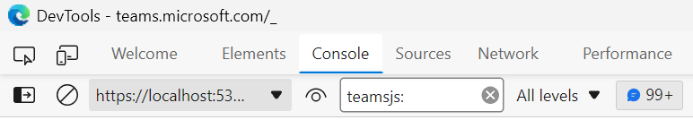
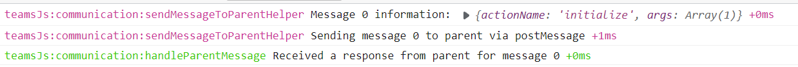

# TeamsJS logging

Enabling logging can be helpful when troubleshooting issues. These instructions are only for enabling local (browser console) logging in the TeamsJS library.

## Enabling logging

TeamsJS logging leverages the popular [debug](https://www.npmjs.com/package/debug) package for logging. If you are already familiar with this package, then you can enable TeamsJS logs by enabling the `teamsJs` logging category. If you are unfamiliar, here are step-by-step instructions:

1. Run your app inside of your chosen web host (e.g., Teams, Outlook, or Office)

2. Open up the browser debugger (F12 in most browsers)

3. On the "Console" tab, in the first dropdown ("JavaScript context"), choose the domain that your app is on.

4. At the console prompt at the bottom, run this command: `localStorage.debug = 'teamsJs.*';` This enables the TeamsJS logging category.

5. Click on the "Log Level" dropdown and ensure "Verbose" is checked (it will probably be set to "Default levels"). All TeamsJs log statements are currently written at Verbose.

Logging should now be enabled for the TeamsJS library. You can most easily see this logging by typing "teamsjs:" into the "Filter" box on the "Console" tab, e.g.

You can confirm by looking for logs in the debug console, e.g.,

These logs are only available in your browser's console; they aren't saved or published anywhere.

**If you choose share your logs, please ensure you don't share any personal or security information like usernames or token values.**

The option to enable these logs is saved to your browser's local storage. Consequently, to disable logging you should either clear your local storage for your app's domain or follow the below steps.

## Disabling logging

1. Run your app inside of your chosen web host (e.g., Teams, Outlook, or Office)

2. Open up the browser debugger (F12 in most browsers)

3. On the "Console" tab, in the first dropdown ("JavaScript context"), choose the domain that your app is on.

4. At the console prompt at the bottom, run this command: `localStorage.debug = '';` This disables all logging from the debug library (the command can be modified to leave other logging categories on, if desired).

5. Refresh your app
